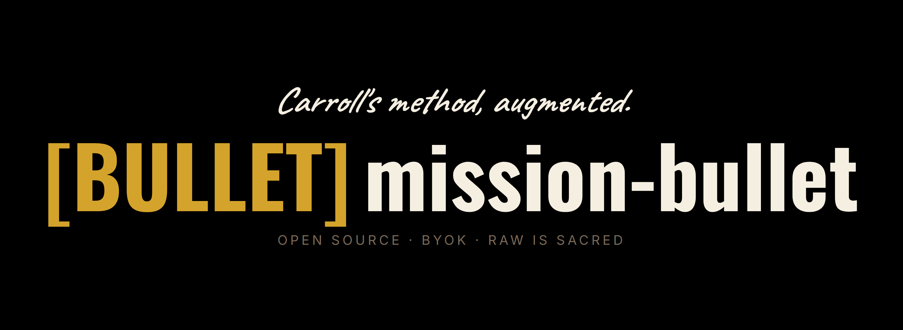

# mission-bullet



Personal AI-assisted bullet journal. Daily-capture,
weekly-process, monthly-reflection. Sits alongside GeneralStaff
(project management) and mission-brain (second brain). This is the
"in-the-moment thought into structured memory" layer that fills
the gap between them.

Not a productivity app. Not a replacement for journaling. A
deliberate tool for the rhythm Ryder Carroll's original bullet
journal method captured on paper: rapid logging, threaded
reflection, migration forward of incomplete items, with AI
touches added *only where they earn their keep*.

**Privacy posture.** Your entries stay on your disk in your
private repo. mission-bullet never modifies your raw text. AI
commentary is opt-in per command and lives in sibling files. The
Ollama path runs fully local; nothing leaves your machine on that
path.

## A quick bullet-journal refresher

Ryder Carroll's original paper bullet-journal method is the design
ancestor for this tool. A handful of his terms show up in the CLI
prompts and reflection files; these are worth knowing:

- **Rapid logging.** Capture tasks, events, and notes as short
  bulleted lines, not paragraphs. The whole point is friction-free
  capture: don't stop to structure, just write.
- **Migration.** At the end of a day, week, or month, review what
  you captured. For each open item, decide whether it's still
  worth doing. If yes, *migrate* it: carry it forward into the next day
  / week / month. If not, strike it out. The decision itself is
  the point; migration forces you to re-commit (or let go) every
  cycle. Day-grain migration lives in `bullet migrate`; week- and
  month-grain in `bullet review week` / `bullet review month`.
- **Threads.** Recurring topics that show up across entries
  without you having tagged them. Carroll called these *threads*;
  mission-bullet surfaces them as **themes** during review.
- **Daily log / weekly log / monthly log.** Three scales of entry.
  `bullet today` is your daily log; `bullet review week` produces
  the weekly log; `bullet review month` (not yet built) will
  produce the monthly log.

So when `bullet review week` asks `[y]accept / [n]reject /
[d]efer` for each item it surfaced, that's Carroll's migration
step: choose which items carry forward, which you're done with,
and which you want to see again next time. *Defer* = "show me this
again next review", Carroll's way of parking something without
fully committing either direction.

## How to journal with mission-bullet

If you've never bullet-journaled before, or it's been a while,
here's a practical guide to actually using this day-to-day. Goal:
low-friction capture, not perfect structure. Write fast, decide
weekly, plan monthly.

### The key (what the signifiers mean)

Carroll's paper method uses short symbols so you can skim an entry
and know at a glance what's a task vs. a thought vs. an event.
Mission-bullet uses plain-text equivalents so everything stays
greppable and editor-friendly:

| Meaning              | Write this       | Example                                 |
|----------------------|------------------|-----------------------------------------|
| Open task            | `- [ ]`          | `- [ ] call the clinic`                 |
| Done task            | `- [x]`          | `- [x] emailed Sam back`                |
| Event / appointment  | `- ○` or `- @`   | `- ○ dentist 2pm`                       |
| Note / thought       | `-`              | `- kids loved the park today`           |
| Priority             | `!` prefix       | `- [ ] ! rent check due Thursday`       |
| Idea / inspiration   | `*` prefix       | `- * batch errands on one day?`         |
| Migrated item        | `>` prefix       | `- [ ] > follow up on Q2 (from last wk)`|

You don't have to use all of them. **The only one the tool actually
parses is `- [ ]` / `- [x]`**. `bullet tasks` scans those and rolls
them up across entries. Everything else is for your eyes only:
skim-aid, not syntax.

### What goes where

- **Daily log** (`bullet today`). Everything as it happens. Tasks,
  events, stray thoughts, reactions, questions. Don't edit yourself,
  don't clean up. That's what review is for.
- **Monthly log** (`bullet month`). Deliberate once-per-month
  planning. The skeleton walks you through three sections:
  *Calendar* (dated events), *Goals for the month* (use `- [ ]`),
  *Bills & recurring* (due dates you can't afford to miss).
- **Weekly review** (`bullet review week`). Sunday-ish. The tool
  pulls up the week's entries, surfaces themes + open items, and
  asks you what to migrate forward. Accepted items land on next
  Monday automatically.
- **Monthly review** (`bullet review month`). End of month. Same
  shape, wider window; also reads your monthly log as context.
  Accepted items become goals in next month's log.

### Marking things done

Just edit the file and change `- [ ]` to `- [x]`. No command, no
flag. Run `bullet tasks` to see everything still open across all
your entries:

```
$ bun run bullet tasks
Open tasks (3):
  [ ] call the clinic                (entries/2026/04/21.md)
  [ ] finish Q2 strategy draft       (entries/2026/04/monthly.md)
  [ ] reset sleep schedule           (entries/2026/04/monthly.md)
```

### A realistic daily entry

What a Tuesday might look like after `bullet today`:

```markdown
# Tuesday

- [ ] ! rent check due Thursday
- [ ] call the clinic about the referral
- [x] emailed Sam back
- ○ dentist 4pm
- kids wanted Spider-Man again, fine by me
- * what if I batched errands to one day?
- [ ] > follow up on Q2 strategy (from last week)

Feeling scattered about GS planning today. Need to carve out real
time for it instead of jamming it between meetings.
```

Stream-of-consciousness is fine. Signifiers help you skim later.

### If you're stuck on what to write

Carroll's heuristic, answering three questions:
*what happened, what do I need to do, what did I think about?*
One bullet each covers it. Write more when something's on your
mind. The tool doesn't care about length.

## Not a project management tool

GS already does task queues, priorities, bot-pickable work.
Mission-bullet entries are not GS tasks. They are raw thoughts,
priorities-of-the-moment, half-formed ambitions, daily reflections,
personal signals. Some may eventually become GS tasks (explicit
migration). Most don't.

## Not a second brain

A second-brain tool like [mission-brain](https://github.com/lerugray/mission-brain)
indexes your history, voice, and knowledge corpus for future
retrieval. Mission-bullet is present-tense capture: what you
thought today, what you want to focus on this week, what you've
been avoiding this month. The two can integrate later (a second-
brain tool could learn from mission-bullet entries) but they are
architecturally separate.

## Where AI earns its keep

Three explicit value adds. Anything else is LLM-wrapped notebook
and should be rejected:

1. **Cross-scale reflection surfacing.** During weekly review,
   the AI surfaces relevant entries from the week's daily
   captures. During monthly review, from the month. No "you
   said X 5 times" nagging. Just relevant context pulled
   forward when you're reflecting.

2. **Migration-candidate proposals.** Classic bullet-journal
   moves incomplete items forward each day/week. AI proposes
   which items to migrate; you accept, reject, or defer per
   item. Never automatic migration.

3. **Emergent theme discovery.** You don't tag as you write.
   During review, AI surfaces themes it sees across entries
   ("healthcare came up 8 times this month"). You decide
   whether the theme matters; the surfacing is the affordance.

A fourth route. `bullet ask` / `claude-note`. Exists for
on-demand commentary on a specific day's entry. The AI writes
to a sibling `.claude.md` file, never to the raw. See the
section below.

## Explicit non-goals (v1)

- **No automatic processing of raw entries.** The whole design
  is "your original thought is sacred; AI touches it only when
  you explicitly invoke a command."
- **No notifications, reminders, streaks, or gamification.**
  This is a tool, not an engagement engine.
- **No cloud sync as a built-in feature.** Local files,
  version-control via git. For moving entries between your home
  PC and work PC, see "Syncing between machines" below.
- **No sharing features.** Personal tool. Sharing/export
  comes later and only if meaningful.
- **No AI-authored entries.** The AI surfaces and proposes; on
  request it writes commentary to a sibling `.claude.md` file.
  It never modifies the raw entry, and it does not write
  original entries from scratch.

## Stack

- TypeScript + Bun (matches mission-swarm + GS).
- Local file storage. `entries/YYYY/MM/DD.md` for daily
  entries, `reflections/YYYY-WNN.md` for weekly, `reflections/
  YYYY-MM.md` for monthly. Plain markdown. Version control
  with git (personal repo, never shared). For a concrete
  multi-machine git setup, see [SYNC.md](./SYNC.md).
- LLM calls via OpenRouter (cloud) or Ollama (local).
- CLI-first. Web UI is optional future layer, not v1.

## Syncing between machines

Your journal content (`entries/`, `reflections/`) lives in private
GitHub repos, separate from this public tool repo. One-time setup
is in [SYNC.md](./SYNC.md). Once both machines are wired up, the
daily workflow is **two commands**:

### The rule

- **PULL before you write.** Always.
- **PUSH after you write.** Always.

Skip the pull and you'll write on stale state; skip the push and
the other machine never sees the new entry. That's the failure
mode 9 times out of 10.

### The two commands

Substituting your own `mission-bullet` path:

**Pull (run before writing on this machine):**

```bash
cd ~/mission-bullet/entries && git pull && cd ../reflections && git pull
```

**Push (run after writing on this machine):**

```bash
cd ~/mission-bullet/entries && git add . && git commit -m "update" && git push && cd ../reflections && git add . && git commit -m "update" && git push
```

That's it. One paste before, one paste after, on whichever machine
you're sitting at. Each command covers both `entries/` and
`reflections/`. Safe to run even when only one of them changed
(git just says "Everything up-to-date" for the other).

PowerShell users: replace `&&` with `;` and quote any paths with
spaces. The full setup walkthrough plus an optional `git sync` alias
that shrinks the daily push to one word lives in
[SYNC.md](./SYNC.md).

### When something does go wrong

The only common failure: you wrote on both machines the same day
without pulling between, so git refuses the push with a
non-fast-forward error. Recovery is in
[SYNC.md → "What if I forget to pull"](./SYNC.md#what-if-i-forget-to-pull-on-the-other-machine-and-write-a-conflicting-entry).
Initial setup, the alias, and FAQs all live there.

## Usage

All commands run through `bun run bullet <subcommand>` from the
repo root. Invoke without arguments (`bun run bullet`) to see the
full help text.

### Quick reference

| Command                                 | What it does                                                  |
|-----------------------------------------|---------------------------------------------------------------|
| `bun run bullet today`                  | Open today's daily entry in your editor; log a session stamp  |
| `bun run bullet month [YYYY-MM]`        | Open the monthly log (Calendar / Goals / Bills)               |
| `bun run bullet migrate`                | Daily migration: y/n/strike per yesterday's open `- [ ]` task |
| `bun run bullet claude-note [YYYY-MM-DD]` | Open/create a sibling `.claude.md` file for AI commentary     |
| `bun run bullet claude-note --ask "Q"`  | Invoke a provider, stream a response, append to `.claude.md`  |
| `bun run bullet ask "Q"`                | Sugar for `claude-note --ask "Q"` with today's date           |
| `bun run bullet review week [YYYY-WNN]` | Weekly review: surface themes + migrate accepted items to Mon |
| `bun run bullet review month [YYYY-MM]` | Monthly review: same shape, month-wide; migrates to next log  |
| `bun run bullet list [flags]`           | Browse entries with task/session counts + first-line snippets |
| `bun run bullet tasks [flags]`          | Roll up `- [ ]` / `- [x]` tasks across every entry            |
| `bun run bullet help`                   | Full help text                                                |

**Useful flags:**
- `--force` on `review week`, `review month`. Overwrite an
  existing output file instead of aborting.
- `--dry-run` on any LLM-using command. Use canned responses
  instead of a real model (zero cost, deterministic. Good for
  trying a flow end-to-end).
- `--ask "<question>"` on `claude-note`. Invoke the LLM with the
  raw entry + prior Q&A as context, stream the response, append
  a new section to `DD.claude.md`.
- `--provider <claude|openrouter|ollama>` on `claude-note --ask`.
  pick the provider for this one call. Use `claude` to run the
  question through your Claude Code subscription (free for you
  when your weekly usage allows), `openrouter` for cloud
  credits, `ollama` for local inference.
- `--model <id>` on `claude-note --ask`. Pick the model. With
  `--provider claude`: `sonnet`, `haiku`, `opus`. With
  `--provider openrouter`: e.g. `anthropic/claude-sonnet-4-6`
  (paid) or `google/gemma-4-31b-it:free` (free default).
- `--week` / `--month` / `--since YYYY-MM-DD` / `--all` on `list`.
- `--open` / `--done` / `--all` on `tasks`.

### Typical rhythm

1. **Every day**. `bun run bullet today`. Rapid capture: tasks,
   events, thoughts. Use the signifier key from "How to journal"
   above (or ignore it; `- [ ]` is the only one that matters
   mechanically). If yesterday left open tasks you want to carry
   into today, run `bun run bullet migrate` first. It'll prompt
   y/n/strike per item before today's entry opens.
2. **Once a month** (start of month). `bun run bullet month`.
   Write the month's goals, bills, calendar. Come back later to
   mark `- [ ]` as `- [x]` as things get done.
3. **End of week**. `bun run bullet review week`. Make migration
   decisions. Accepted items auto-land on next Monday.
4. **End of month**. `bun run bullet review month`. Same flow but
   wider; accepted items land in next month's goals.
5. **Anytime**. `bun run bullet list` to see what you've written,
   `bun run bullet tasks` to see what's still open, or `bun run
   bullet ask "..."` to ping an LLM about today's entry.

### Setup

1. **Copy `.env.example` to `.env`**. Gitignored, one copy per
   machine. The tool auto-picks a provider via env vars, and `.env`
   is where those live. Minimum useful content:
   ```
   MISSION_BULLET_PROVIDER=openrouter
   OPENROUTER_API_KEY=sk-or-v1-your-key-here
   MISSION_BULLET_CLAUDE_NOTE_MODEL=google/gemma-4-31b-it:free
   ```
2. **Why pin OpenRouter instead of letting the tool auto-resolve?**
   The auto-resolver prefers Ollama first (local, private). If you
   don't have a GPU for Ollama, the next fallback is the Claude
   Code CLI. Which would tax your Claude subscription on every
   review/ask. Pinning `MISSION_BULLET_PROVIDER=openrouter` keeps
   everything on your OpenRouter credits.
3. **Per-feature model knob:**
   - `MISSION_BULLET_CLAUDE_NOTE_MODEL`. What `claude-note --ask`
     uses by default. Free Gemma 4 31B is the shipped default so
     casual commentary doesn't burn credits. Override per-call
     with `--model`.
4. **Each machine needs its own `.env`.** The file is gitignored
   and won't sync via the `mission-bullet-entries` workflow. On a
   new machine, copy the values manually (or use a secrets
   manager. Your OpenRouter key is the same everywhere).

### Daily capture. `bun run bullet today`

Opens `entries/YYYY/MM/DD.md` in your editor. If the file doesn't
exist, creates a skeleton. Write whatever you want. Stream of
consciousness, bullets, markdown, whatever. Save and close.

Each invocation appends a timestamp to the entry's `sessions`
frontmatter list in the America/New_York timezone (so you get a
lightweight "when did I sit down to journal" log. EDT in summer,
EST in winter, handled automatically). The timestamp lands in
metadata only; the body you typed is never touched.

### Daily migration. `bun run bullet migrate [--from YYYY-MM-DD] [--to YYYY-MM-DD]`

Carroll's day-grain migration step: walk yesterday's open `- [ ]`
tasks one at a time and decide what to do with each. No LLM, no
network. Pure local logic. Typical morning use:

```
$ bun run bullet migrate

Open tasks from 2026-04-22 -> migrate forward to 2026-04-23:

Task 1/3:
  - [ ] call the clinic about the referral
  [y]accept / [n]reject / [s]trike / [q]uit: y

Task 2/3:
  - [ ] finish Q2 strategy draft
  [y]accept / [n]reject / [s]trike / [q]uit: n

Task 3/3:
  - [ ] reset sleep schedule
  [y]accept / [n]reject / [s]trike / [q]uit: s

Decisions: 1 accept, 1 reject, 1 strike
Carried 1 item(s) forward -> entries/2026/04/23.md
Struck 1 item(s) on 2026-04-22.
```

What each decision does:

- **`[y]accept`**. Carries the task forward. Today's entry gets a
  new `- [ ] task text (from 2026-04-22)` bullet under a
  `## Migrated items` section, so it's actionable and `bullet tasks
  --open` picks it up. Yesterday's `- [ ] X` becomes
  `- [x] X (migrated to 2026-04-23)` so it's no longer counted as
  open and the trail shows where it went. Yesterday's frontmatter
  records the destination too.
- **`[n]reject`**. Leaves yesterday's `- [ ]` untouched. It stays
  open and will reappear next time you run `bullet migrate`. Use
  for "I'll deal with this tomorrow."
- **`[s]trike`**. Yesterday's `- [ ] X` becomes `- [x] ~~X~~`. No
  destination, no migration. Use for "this no longer matters /
  solved itself / not worth doing." The strikethrough is the
  human-readable signal that it didn't actually get done; the
  `[x]` is the tooling shorthand for "no longer open."
- **`[q]uit`**. Applies whatever you decided so far and stops
  prompting. Re-run `bullet migrate` to resume on the rest.

**Tool-authored lines are tagged.** Every line `bullet migrate`
writes or rewrites carries a trailing
`<!-- bullet-migrate auto-mark -->` HTML comment. Invisible in
rendered markdown, visible in the raw `.md` you edit. The point
is unambiguous attribution: any LLM ingesting your entries (e.g.
for `bullet ask`) can tell tool annotations from your own
writing without guessing. Don't strip the comments. They're
load-bearing for the voice/input separation.

**Source resolution.** With no flags, the command walks back from
today until it finds a daily entry with at least one open task.
typically yesterday, but it'll skip weekends, vacations, or any
gap when you didn't journal (cap: 14 days back). Override with
`--from YYYY-MM-DD` to pull from a specific day, `--to YYYY-MM-DD`
to land in a specific destination day (default: today).

**Run it before `bullet today`.** Then when the editor opens, the
migrated items are already at the bottom of today's entry under
the `## Migrated items` section, ready to act on.

**Re-running is safe.** Already-migrated bullets are skipped on
the destination side; already-marked source lines are no longer
"open" and won't appear in the prompt list.

### Parallel AI notes. `bun run bullet claude-note [YYYY-MM-DD]`

A **parallel journal** where AI commentary on a day's entry can
live alongside the raw without ever touching the raw text. Lives
at `entries/YYYY/MM/DD.claude.md`. Sibling to `DD.md` (raw).

**Why this exists.** Sometimes an entry sparks a real conversation
with an AI. Honest feedback, pushback, reading pointers, a
different angle you didn't consider. That kind of exchange is
worth keeping (re-reading a year later, you see not just what you
wrote but how a thoughtful outside voice responded). But it is
emphatically **not your journal**. It's commentary on your
journal, and it has to be stored in a way that keeps the
distinction clear.

**Where the two files sit side-by-side:**

| File                 | Who writes it          | What it is                           |
|----------------------|------------------------|--------------------------------------|
| `DD.md`              | You (raw capture)      | The sacred original. Never modified |
| `DD.claude.md`       | AI, when you ask       | Commentary / feedback / pushback     |

`DD.claude.md` is skipped by `bullet list` and `bullet tasks` so
it never inflates your task counts or entry listings. Safe to
delete anytime. The raw entry is untouched.

#### Two modes, same command

**Editor mode**. `bun run bullet claude-note`

Opens (or creates) `DD.claude.md` in your editor. No LLM call from
the tool; you or another AI assistant (Claude Code, etc.) fills
in the commentary by hand. Useful if you're already in a Claude
Code conversation and want to paste what came out of it.

**Ask mode**. `bun run bullet claude-note --ask "<question>"`

Invokes an LLM provider directly from the shell. Loads your raw
entry + any prior Q&A in the notes file, ships it all to the
model as context, streams the response into stdout, and appends
a new timestamped section to `DD.claude.md`. For the everyday
case, use the short alias:

```bash
bun run bullet ask "what do you think about my zionism observation"
```

Same as `bullet claude-note --ask "..."` with today's date.

#### What the model sees

- **System prompt:** a codified voice. Honest, pushback allowed,
  no sycophancy, no therapy-speak, no moralizing. Peer reading a
  friend's journal, not an assistant. This is fixed in code so
  every ask inherits it.
- **Raw entry** for the day, verbatim.
- **Prior Q&A** from `DD.claude.md`. Each earlier question and
  response becomes a user/assistant turn, so follow-ups like
  "elaborate on your second point" work naturally.
- **Your `--ask` text** as the final user turn.

#### What lands on disk

Each `--ask` appends one section to `DD.claude.md`:

```markdown
## 2026-04-22T05:30:00-04:00. Openrouter (google/gemma-4-31b-it:free)

**Question:** what do you think about my zionism observation

[streamed response here]
```

Multiple asks stack chronologically, so re-reading shows a
conversation. Model name in every header. Re-reading next month
you can tell which response was free Gemma vs paid Sonnet.

If the stream fails mid-response (rate limit, network glitch), the
partial content is kept with a `[TRUNCATED mid-response: ...]`
marker rather than being thrown away.

#### Provider + model

Env-driven provider priority (Ollama → OpenRouter → Claude CLI).
Since the work PC has no GPU for Ollama, the shipped `.env` pins
`MISSION_BULLET_PROVIDER=openrouter` and defaults `--ask` to the
free Gemma 4 31B model.

**Override the model per-call with `--model`:**

```bash
# Paid Sonnet via OpenRouter credits for higher-quality commentary
bun run bullet ask "follow up" --model anthropic/claude-sonnet-4-6

# Paid Opus for the top-quality reading
bun run bullet ask "dig deeper" --model anthropic/claude-opus-4-7
```

**Override the provider per-call with `--provider`:**

This is how you route a specific question through your Claude
subscription instead of OpenRouter (e.g. when your weekly Claude
usage has refreshed and you'd rather spend subscription tokens
than OpenRouter credits for this particular question):

```bash
# Claude subscription, Sonnet tier
bun run bullet ask "q" --provider claude --model sonnet

# Claude subscription, Haiku tier (cheapest, fastest)
bun run bullet ask "q" --provider claude --model haiku

# Claude subscription, Opus tier (highest quality, heaviest usage)
bun run bullet ask "q" --provider claude --model opus
```

The `claude` provider runs your question through the locally-
installed Claude Code CLI. No API key to manage, no separate
billing. It uses whatever subscription tier you have. When
`--provider claude` is set without `--model`, the CLI picks its
own default (typically Sonnet).

**Override the default model permanently** via the
`MISSION_BULLET_CLAUDE_NOTE_MODEL` env var. Keep its value
consistent with whatever provider you've pinned in `.env`. An
OpenRouter model id won't mean anything to the Claude CLI and
vice versa. When `--provider` overrides the env-set provider for
a call, this env default is deliberately ignored so the per-call
`--model` (or the provider's own default) is used.

#### Privacy note (read once, then decide)

`--ask` sends your entry content to OpenRouter and the upstream
model provider. Free models (Gemma, Qwen-free) may use your
requests as training data per their upstream TOS. Paid models
(Claude, GPT, etc. via OpenRouter) are zero-training by default
and short-retention for billing. Neither is zero-trace.

If a particular entry feels too sensitive, use editor mode (no
LLM call at all) or skip the command entirely. Nothing in
mission-bullet requires you to use it.

#### `--dry-run`

Works on `claude-note --ask` like on every other LLM command.
returns a short canned response, no tokens spent, no network
calls. Useful for walking through the flow end-to-end on a new
machine before the OpenRouter key is configured.

### Weekly review. `bun run bullet review week [YYYY-WNN] [--force]`

Loads the current ISO week's entries (Mon–Sun), streams them to
the model, and in **one LLM call** surfaces:

- **Themes** that appear across multiple entries (shown as a list
  with the dates they appeared on)
- **Migration candidates**. Open tasks, recurring concerns,
  unresolved questions from the week

For each migration candidate, you're prompted interactively:
`[y]accept / [n]reject / [d]efer / [q]uit`. Your decisions land in
`reflections/YYYY-WNN.md` under a clearly-marked "AI-surfaced
migration candidates / your decisions" section.

The reflection file has three sections, all visually distinct:
- `## AI-surfaced themes` (from the model)
- `## AI-surfaced migration candidates. Your decisions` (the model
  found them; you accepted/rejected)
- `## Your reflection notes` (your own space, opens in the editor
  so you can type freely after the AI content is written)

**Accepted items are carried forward automatically.** Each one gets
appended to next Monday's entry under a clearly-labeled
`## Migrated items` section (with an HTML provenance banner so you
can always tell what the tool added vs. what you wrote). The source
entry's `migrated_to` frontmatter records where items went so you
can trace backwards later. Re-running the review doesn't
double-migrate. Already-carried items are skipped.

Deferred items stay in this week's reflection as `"defer"`. They
don't auto-migrate. The model will usually resurface them at the
next review if they're still live in your entries.

Defaults to the current week. Pass a specific ISO week like
`2026-W17`. Pass `--force` to overwrite an existing reflection.

### Monthly review. `bun run bullet review month [YYYY-MM] [--force]`

Same shape as weekly, wider window. Loads the calendar month's daily
entries plus the monthly log itself (so the model sees your goals,
calendar, and bills as context). Surfaces themes + migration
candidates across the whole month.

Accepted items land as `- [ ]` tasks in **next month's monthly log**,
under the "Goals for the month" section. So when you open next
month's `bullet month` you see the carried-forward items right where
you plan.

Defaults to the current month. Pass `YYYY-MM` for a specific month.

### Monthly log. `bun run bullet month [YYYY-MM]`

Opens `entries/YYYY/MM/monthly.md`. Carroll's month-scale planning
artifact. The skeleton template pre-populates three sections:

- `## Calendar`. Appointments and dated commitments
- `## Goals for the month`. Use `- [ ]` for tasks; they show up in
  `bullet tasks` and can be migrated forward at month-end review
- `## Bills & recurring`. Due dates and recurring commitments

Each invocation appends an Eastern-time session stamp to the log's
frontmatter, same pattern as `bullet today`.

Defaults to the current month. Pass `YYYY-MM` for any month.

### Browse. `bun run bullet list [--week|--month|--since YYYY-MM-DD|--all]`

Shows recent entries with per-entry task/session counts and
first-line snippets. Example:

```
Range: week

Daily entries (3):
  DATE        TASKS   SESS  FIRST LINE
  2026-04-21  2/3      2    # Tuesday
  2026-04-20  0/1      1    # Monday morning
  2026-04-18  1/2      1    # Week wrap-up

Monthly logs (1):
  MONTH       TASKS   SESS  FIRST LINE
  2026-04     3/8      5    # April 2026. Monthly log
```

Defaults to all entries. Use the flags to scope: `--week` for the
current ISO week, `--month` for the calendar month, `--since
YYYY-MM-DD` for arbitrary ranges.

### Tasks. `bun run bullet tasks [--open|--done|--all]`

Scans every entry and monthly log for GFM task-list syntax
(`- [ ]` and `- [x]`), rolls them up with their source files. Use
to see everything still open, celebrate everything done, or audit
the full list.

Defaults to `--open`. The syntax the scanner recognizes:

```
- [ ] some open task           # open
- [x] some finished task       # done (x)
- [X] some finished task       # done (capital X also OK)
```

Indented tasks under other bullets work the same way.

### Dry-run mode (free iteration)

Every command that calls the LLM (`review week`, `review month`,
`claude-note --ask`) accepts `--dry-run`, which swaps in a canned
provider that returns deterministic responses without any API
call. Useful for:

- Walking through a flow on a machine with no provider configured
- Iterating on CLI UX without burning tokens
- Exercising the full pipeline end-to-end for testing

Canned review returns a small synthetic JSON response. Canned
`--ask` returns a short banner-prefixed string.

### What lives where on disk

- `entries/YYYY/MM/DD.md`. Your raw daily entry (git-ignored,
  never committed to this repo)
- `entries/YYYY/MM/DD.claude.md`. Parallel AI commentary sibling,
  produced on demand by `claude-note` (skipped by `list`/`tasks`)
- `entries/YYYY/MM/monthly.md`. The monthly log for that month
- `reflections/YYYY-WNN.md`. Weekly reflection produced by
  `review week`
- `reflections/YYYY-MM.md`. Monthly reflection (future, mb-006)

## Privacy posture

Your entries are personal. Thoughts, unrefined feelings, things
you wouldn't say out loud. The tool repo is public; **your entries
repo never should be.** `entries/` and `reflections/` are gitignored
here on purpose, and `SYNC.md` walks through pointing them at your
own private GitHub repos.

Don't add collaborators to your entries repo. Don't integrate it
with platforms that would require sharing. The whole design of this
tool is "your raw thoughts stay yours". Preserve that.

## Sibling tools

mission-bullet is one of a small family of personal-data tools that
share a design floor: your data on your disk, your keys for paid
providers, no SaaS layer.

- **[GeneralStaff](https://github.com/lerugray/generalstaff)**.
  multi-project bot orchestrator with hands-off enforcement and
  audit logging. Mission-bullet is registered as a Mode B project
  in GS for its own build-out tracking.
- **[mission-brain](https://github.com/lerugray/mission-brain)**.
  queryable second brain over your own writing, citation-grounded
  retrieval. Companion for "what have I written about X?" queries
  while mission-bullet handles "what am I thinking right now?"
  capture.
- **[mission-swarm](https://github.com/lerugray/mission-swarm)**.
  swarm-simulation engine for plausible audience reactions,
  audience-template-driven. Useful adjacent to mission-bullet for
  thinking through how a draft post or announcement might land.
